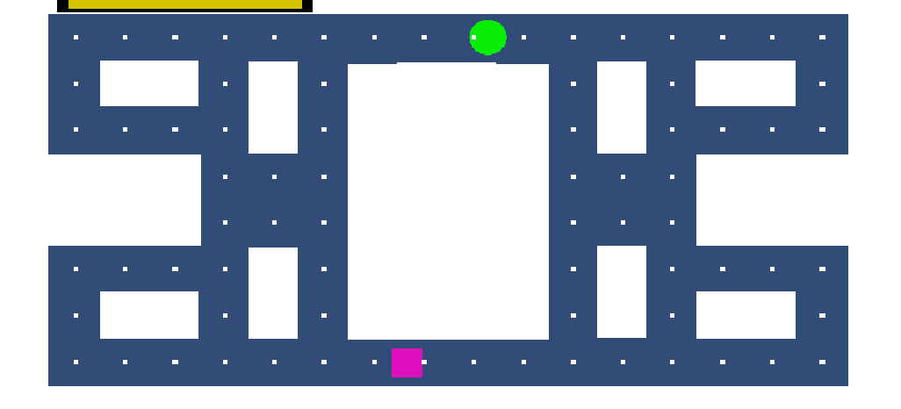

# pacman-Dean-Andreu

pacman league of legends mash up.

map thema = summoners rift
ghosts = timo
main player = Vargas
het idee is dat je als Vargas je barrels oppakt om een kleine boost te krijgen om de timo te damagen
als je teveel barrels oppakt in een korte tijd wordt de dizzy mechanic geactiveerd. Deze mechanic randomized je 

Timo begint altijd op dezelfde plek. Hij kan stil staan en na een paar seconden stil staan wordt hij invisible. Je kan timo niet raken in de tijd dat hij stil staat. Er zijn twee verschillende power ups een voor de vijand en de andere voor de traps.

hier is het uiteindelijke spel dat we gemaakt hebben er zijn een paar features weg gelaten maar ik ben alsnog heel erg blij met het resultaat.

Je kan zien dat als je geen power up hebt opgepakt dat de traps damage doen en als je er wel eentje hebt opgepakt dat ze dat niet doen. nadat je een keer geen damage hebt genomen raak je de powerup kwijt. als je een power up hebt en de enemy raakt win je het spel.
